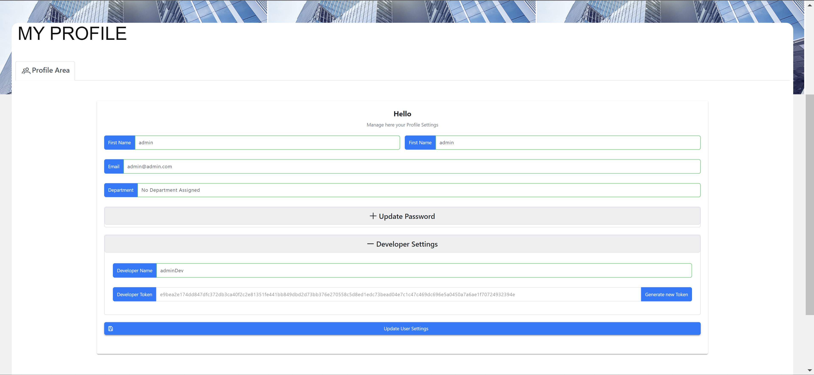

# Getting Started: Using our API

Congratulations! :partying_face: You have installed the LTEP Athena Platform and you are now ready to go to build your amaing Datascience and Automation projects.

## Prerequisites

Before you begin, ensure you have installed Python3 and our LTEP Athena © PythonAPI :snake::

- Python3: [Install Python3](https://www.python.org/)

  **AND**

- LTEP Athena © PythonAPI: pip install LTEP-Athena-API

Checkout our official Repo: [LTEP Athena API](https://github.com/efstratios97/ltep_athena_api)

## Basics

### Authentification

First we have to authenticate ourselves to the platform. You have to create an AthenaAuth object and pass the relevant information. You can find the auth data in your personal profile: http://localhost/?#/profilearea



```python
from ltep_athena_api.athena_api import AthenaAPI
from ltep_athena_api.authenticate import AthenaAuth

athena = AthenaAPI()
auth = AthenaAuth(
  developer_token="e9bea2e174dd847dfc372db3ca40f2c2e81351fe441bb849dbd2d73bb376e270558c5d8ed1edc73bead04e7c1c47c469dc696e5a0450a7a6ae1f70724932394e",
  developer_name="adminDev",
  email="admin@admin.com",
  host_api_address_sandbox="http://localhost:27000",
  host_api_address_streaming="ws://localhost:27097")
```

### Save/Retrieve data from the LTEP Athena ©

Now, let's create our first dataset. You can create your own dataset in the LTEP Athena © directly or use the API. You can also retrive from the platform. Here are some examples. See the docs in the LTEP Athena Repo for more options.

```python
import pandas as pd
from ltep_athena_api.models.DataSet import DataSet
from ltep_athena_api.athena_api import AthenaAPI
from ltep_athena_api.authenticate import AthenaAuth

athena = AthenaAPI()
auth = AthenaAuth(
  developer_token="e9bea2e174dd847dfc372db3ca40f2c2e81351fe441bb849dbd2d73bb376e270558c5d8ed1edc73bead04e7c1c47c469dc696e5a0450a7a6ae1f70724932394e",
  developer_name="adminDev",
  email="admin@admin.com",
  host_api_address_sandbox="http://localhost:27000",
  host_api_address_streaming="ws://localhost:27097")

# We read our data with help of pandas
data = pd.read_excel("<your-path-to-file>")
# We create an DataSet object
dataset = DataSet(name="test", description="my first dataset", label="my-data", data=data)
# We save the DataSet object in the LTEP Platform
athena.save_dataset(dataset=dataset, auth=auth)
# Get newest DataSet id by label
dataset_id = athena.get_newest_dataset_by_label(dataset_label='my-data',auth=auth)
# Get DataSet by id as pandas DataFrame
my_dataset = athena.get_data(dataset_id, auth=auth)
```

### Registring your Code and making your projects available in LTEP Athena via CustomOperations

The LTEP Athena API lets you develop and build Datascience and Automation programms with zero limitations. To make your awesome programms now available to your stakeholders, you have to add three more lines of code.
First, you have to adjust your entry functions, which shall be called whenever you request the execution of one your projects. Think of it as your main-function for each programm you want to call.

1. Register your entry function

First, you have to register the function that shall be called. We refer to them as **CustomOperations**. Here you have two options, if the function is a data streaming function you use register `register_streaming_function` or if the function is a one-time data push you use `register_function`.

2. Adjust your CustomOperation

In order to deal with any type of user inputs from the LTEP Platform, you should have as arguments of your CustomOperation args and kwargs. You can then retrieve them easily from there and process them further.

3. Starting you webservice

The last step to make your CustomOperations available is to run your programm. For that purpose you have to your project as a webservice. The LTEP Athena API takes complete care of that. Just call: `initiate_service()` from `ltep_athena_api.microservice`. This will transform your application into a webservice, which integrates and interacts with the LTEP Athena Platform.

```python
from ltep_athena_api.microservice import AthenaRestAPI
from ltep_athena_api.athena_api import AthenaAPI
from ltep_athena_api.authenticate import AthenaAuth

athena = AthenaAPI()

auth = AthenaAuth(developer_token="e9bea2e174dd847dfc372db3ca40f2c2e81351fe441bb849dbd2d73bb376e270558c5d8ed1edc73bead04e7c1c47c469dc696e5a0450a7a6ae1f70724932394e",
developer_name="adminDev",
email="admin@admin.com",
host_api_address_sandbox="http://localhost:27000",
host_api_address_streaming="ws://localhost:27097")

def your_custom_operation(*args, **kwargs):
  # your entry function to your custom code/project

if __name__ == "__main__":
    athena.register_function(show_data)
    athena_rest = AthenaRestAPI(athena)
    athena_rest.initiate_service()
```

## Analysis Block

An Analysis Block's primary purpose is to give you the possibility to execute your custom data analytics or science algorithms and display the results to your stakeholders. Additionally, it enables you to easily define custom Inputfields to gather input and make your Analyses interactive.

Your Analyisblock will be available in the Sandbox section in the LTEP Athena Platform and you will be able to deliver it to any of your Stakeholders' Executive Dashboards.

There are two ways to deliver your data analytics and science results to your stakeholders. First, you can use our builtin support for FusionCharts. Fusioncharts is one of the most powerful Visualization librarys that allows you to build virtually any Chart by using simple JSON Configurations. However, you will need to purchase a license. The second option is to use any library that supports web-based graph rendering like bokeh.

No matter what way you choose, you deliver your data analytics and visualization via AnalysisBlocks. An AnalyisBlocks consists of three parts.

- Title, subtitle and according dataset_label
- A CustomOperation delivering your analysis
- Inputfield for your stakeholder

```python
athena.create_analysis_block(AnalysisBlock.AnalysisBlock( title="myCoolAnalyisBlock",dataset_label="your-data-label"),custom_operation=CustomOperation.CustomOperation("my_awesome_data_analysis"), inputfields=[InputForm.InputField(title="UserInput", subtitle="description of your userinput",input_field_type=InputForm.InputFieldType.DROP_DOWN.name, input_field_retrieval_operation_name="input_field_values")], auth=auth)
```

That's basically all you have to add. Let's break it down in the next sections.

### Creating a CustomOperation using FusionCharts

A CustomOperations for Analyis Blocks are very similar to any other CustomOperation in the LTEP Athena API. As with any CustomOperation, LTEP Athena puts you no limits when it comes to creating custom operations. However, they differ in the required return type. First, let's look how you can use FusionCharts's visualization powers to deliver your data analytics results.

FusionChart lets you create virtually any visualization by just defining a JSON. This JSON is then rendered and sisplayed by FusionCharts. For more info how to create awesome visualizations with Fusioncharts consult their [documentation](https://www.fusioncharts.com/dev/).

The only thing you have to do, is to return your ready configured FusionChart JSON in your CustomOperation within a list. That's all and the rest we take care of :wink:

In the following example we show you how to create a CustomOperation called display_all_countries.

```python
import pandas as pd
from ltep_athena_api.models import CustomOperation

# Your CustomOperation
def display_all_countries(*args, **kwargs):
    # Downloaded from kaggle: https://www.kaggle.com/datasets/nelgiriyewithana/countries-of-the-world-2023

    data: pd.DataFrame = pd.read_csv(
        "C:\\<your-user\\Downloads\\world-data-2023.csv")
    data.dropna(inplace=True)
    # Transform Country to GDP as dict
    country_gdp_dict = data.set_index('Country')['Urban_population'].to_dict()
    # Put data in FusionCharts Json
    chartData = []
    {chartData.append({"label": k, "value": int(str(v).replace(",", ""))}) for (
        k, v) in country_gdp_dict.items()}
    dataSource = {
        "chart": {
            "caption": "Population per Country",
            "subcaption": "In absolute numbers #",
            "xaxisname": "Country",
            "yaxisname": "Population",
            "theme": "fusion"
        },
        "data": chartData
    }
    result = {
        "id": "10",
        "type": "column2d",
        "width": "100%",
        "height": "350",
        "dataFormat": "json",
        "dataSource": dataSource
    }
    return [result]

your_custom_operation_fusionchart=CustomOperation.CustomOperation("display_all_countries")
```

### Creating a CustomOperation using any web-based visualization tool

A CustomOperations for Analyis Blocks are very similar to any other CustomOperation in the LTEP Athena API. As with any CustomOperation, LTEP Athena puts you no limits when it comes to creating custom operations. However, they differ in the required return type. Let's look how you can use any visualization tool supporting web-rendered visualizations. For demonstration purposes we are going to use the popular [bokeh](https://bokeh.org/) library.

To create your own web-based visualization LTEP Athena API provides you with a great tool to structure your results. With the `CustomHTMLDocument` provided by the LTEP Athena API you only have to pass the html component to `CustomHTMLDocument` as a minimum input requirement and you already got yourself your own visualization when returned by your CustomOperation. You can enhace your `CustomHTMLDocument` with further styling (css or stylesheets) and logic (js-library-ref). The possibilities as usually are therefore limitless.

Similar to [creating a CustomOperation using FusionCharts](#Creating-a-CustomOperation-using-FusionCharts), the only thing you have to do, is to return your ready configured `CustomHTMLDocument` object in your CustomOperation within a list. That's all and the rest we take care of :wink:

```python

from ltep_athena_api.models.CustomHTMLDocument import CustomHTMLDocument
from bokeh.plotting import figure, output_file, curdoc
from bokeh.embed import components
from bokeh.io import curdoc
from bokeh.layouts import column


def bokeh_demo(*args, **kwargs):
    bokeh_version = "3.0.2"
    output_file("bubble_plot.html")
    curdoc().theme = 'dark_minimal'
    TOOLS = "hover,crosshair,pan,wheel_zoom,zoom_in,zoom_out,box_zoom,undo,tap,box_select,poly_select,reset,save"
    p = figure(x_range=['x1', 'x2', 'x3'],  height=450, title="Heatmap",
               tools=TOOLS, toolbar_location="below")
    p.scatter(x=['x1', 'x2', 'x3'], y=[1, 2, 3], fill_alpha=2, size=5, line_color="blue")
    layout = column(p, sizing_mode='stretch_both')
    script, html = components(
        layout, wrap_script=False, theme='dark_minimal')
    return CustomHTMLDocument(html=html, script=script, stylesheet_ref=["https://cdn.bokeh.org/bokeh/release/bokeh-0.13.0.min.css"], javascript_library_ref=[f"https://cdn.bokeh.org/bokeh/release/bokeh-{bokeh_version}.min.js"])


custom_operation = CustomOperation.CustomOperation(
    custom_operation_func_signature="bokeh_demo")
```

### Creating a user InputField

Inputfields are an essential component of Analysis Block to make your data analytics interactive and responsive to user input.
With Inputfields you allow the user to pass user input, which you can grab and process in your CustomOperation.

To create a user inputfield you have multiple configuration options. We are going cover here the basic configuration options. Please consult the our [LTEP Athena API docs](https://ltep-athena-api.readthedocs.io/en/latest/ltep_athena_api.models.html) for more in-depth options.

1. Give your Inpufield a title and a subtitle.
2. Choose what kind of InputField you want. Currently you have the following options:
   - `DROP_DOWN`
   - `MULTI_SELECT`
   - `TEXT_INPUT_FIELD`
   - `TIME_HORIZON`
   - `CALENDAR`
3. Define if the user select options shall be directly derived from your dataset by passing the column name or use a CustomOperation returning input options.
4. Define a key with which you can unambiguously retrieve the passed information in your custom operation.

In your CustomOperation, you can use the passed unique key to retrieve the selected user input from the user and further process it. That is also why CustomOperation expect `*args` and `*kwargs` as function parameters as described in the [Basics section](#registring-your-code-and-making-your-projects-available-in-ltep-athena-via-customoperations).

You can provide your user with multiple InputFields in one Analysis Block by passing to an Analyis Block your InputFields in a list.

### Complete Analysis Block Example with Bokeh

Here we showcast you, how to create an AnalyisisBlock using a `CustomHTMLDocument`.

```python
from bokeh.layouts import column
from bokeh.io import curdoc
from bokeh.embed import components
from bokeh.plotting import figure, output_file, curdoc
from ltep_athena_api.athena_api import AthenaAPI
from ltep_athena_api.authenticate import AthenaAuth
from ltep_athena_api.microservice import AthenaRestAPI
from ltep_athena_api.models import AnalysisBlock, CustomOperation, InputForm
from ltep_athena_api.models.CustomHTMLDocument import CustomHTMLDocument

athena = AthenaAPI()
auth = AthenaAuth(
developer_token="e9bea2e174dd847dfc372db3ca40f2c2e81351fe441bb849dbd2d73bb376e270558c5d8ed1edc73bead04e7c1c47c469dc696e5a0450a7a6ae1f70724932394e",
developer_name="adminDev",
email="admin@admin.com",
host_api_address_sandbox="http://localhost:27000",
host_api_address_streaming="ws://localhost:27097")


##################################################
# Create a CustomOperation                       #
##################################################

def bokeh_demo(*args, **kwargs):
    bokeh_version = "3.0.2"
    output_file("bubble_plot.html")
    curdoc().theme = 'dark_minimal'
    TOOLS = "hover,crosshair,pan,wheel_zoom,zoom_in,zoom_out,box_zoom,undo,tap,box_select,poly_select,reset,save"
    p = figure(x_range=['x1', 'x2', 'x3'],  height=450, title="Heatmap",
               tools=TOOLS, toolbar_location="below")
    p.scatter(x=['x1', 'x2', 'x3'], y=[1, 2, 3], fill_alpha=0.6, size=3,
              line_color=None)
    layout = column(p, sizing_mode='stretch_both')
    script, html = components(
        layout, wrap_script=False, theme='dark_minimal')
    return CustomHTMLDocument(html=html, script=script, stylesheet_ref=["https://cdn.bokeh.org/bokeh/release/bokeh-0.13.0.min.css"],
    javascript_library_ref=[f"https://cdn.bokeh.org/bokeh/release/bokeh-{bokeh_version}.min.js"])

my_custom_operation = CustomOperation.CustomOperation("bokeh_demo")

##################################################
# Create a InputField                            #
##################################################

def input_field_values():
    return ["No Input - Just Demo"]

my_custom_input_field = InputForm.InputField(title="myInput", subtitle="test", input_field_type=InputForm.InputFieldType.DROP_DOWN.name, input_field_retrieval_operation_name="input_field_values")

##################################################
# Create an AnalysisBlock                        #
##################################################

my_analysis_block = AnalysisBlock.AnalysisBlock(
        title="myBokehDemo",
        dataset_label="no-label")

##################################################
# Publish Analysis Block in LTEP Athena          #
##################################################

athena.create_analysis_block(anylisi_block=my_analysis_block, custom_operation=my_custom_operation,
inputfields=[my_custom_input_field],
auth=auth)

athena.register_function(input_field_values)
athena.register_function(bokeh_demo)

athena_rest = AthenaRestAPI(athena)
athena_rest.initiate_service()
```

### Complete Analysis Block Example with FusionCharts and InputField

Here we showcast you, how to create an AnalyisisBlock using FusionCharts and a dataset from Kaggle: https://www.kaggle.com/datasets/nelgiriyewithana/countries-of-the-world-2023

```python
import pandas as pd
from ltep_athena_api.athena_api import AthenaAPI
from ltep_athena_api.authenticate import AthenaAuth
from ltep_athena_api.microservice import AthenaRestAPI
from ltep_athena_api.models import AnalysisBlock, CustomOperation, InputForm

##################################################
# Create a CustomOperation                       #
##################################################

def display_all_countries(*args, **kwargs):
    # Get the user input
    country = kwargs.get("country")[0]
    # Read the data in your function
    data: pd.DataFrame = pd.read_csv(
        "C:\\<your-user>\\world-data-2023.csv")
    # Do your data transformations as you need - No Limits as promised ;)
    data = data.dropna().drop(columns=["Calling Code", "Latitude", "Longitude"]).set_index("Country").apply(
        pd.to_numeric, errors='coerce').dropna(axis=1).loc[country].to_dict()
    # Put data in FusionCharts Json
    chartData = []
    {chartData.append({"label": category, "value": value}) for
     (category, value) in data.items()}
    dataSource = {
        "chart": {
            "caption": country,
            "subcaption": f"Various data about {country}",
            "xaxisname": "Country",
            "yaxisname": "Values",
            "theme": "fusion"
        },
        "data": chartData
    }
    result = {
        "id": "10",
        "type": "column2d",
        "width": "100%",
        "height": "350",
        "dataFormat": "json",
        "dataSource": dataSource
    }
    return [result]

my_custom_operation = CustomOperation.CustomOperation("display_all_countries")

##################################################
# Create a InputField                            #
##################################################

def input_field_values_countries():
    data = pd.read_csv(
        "C:\\<your-user>\\world-data-2023.csv")
    return list(data.get("Country"))

my_custom_input_field = InputForm.InputField(title="myInput", subtitle="test", input_field_type=InputForm.InputFieldType.DROP_DOWN.name, input_field_retrieval_operation_name="input_field_values_countries")

##################################################
# Create an AnalysisBlock                        #
##################################################

my_analysis_block = AnalysisBlock.AnalysisBlock(
        title="myBokehDemo",
        dataset_label="no-label")

##################################################
# Publish Analysis Block in LTEP Athena          #
##################################################

athena.create_analysis_block(anylisi_block=my_analysis_block, custom_operation=my_custom_operation,
inputfields=[my_custom_input_field],
auth=auth)

athena.register_function(input_field_values_countries)
athena.register_function(display_all_countries)

athena_rest = AthenaRestAPI(athena)
athena_rest.initiate_service()
```

## Workflow Operation

A workflow represents any type of operation that can be manually as well as automatically triggered based on time constraints or data changes. The possibilities are endless from recurring web crawling oprations, or ETL-operations triggered by data changes to any type of automation tasks everything is possible.
The way how you create them follows the principles of any other operation in LTEP Athena. First, you create your CustomOperation (entry function) and register it (as usually). Then, you pass your Customoperation to a workflow object with a name and an optional description. That easy :wink:

```python
athena.create_workflow_operation(
  workflow_operation=WorkflowOperation.WorkflowOperation(name='Your awesome ETL',description='Extract, Transform and Load your data',custom_operation_func_signature='your_awesome_etl_process'), auth=auth)
```

This workflow object will be now available as an workflow operation in the LTEP Athena Platform. From here on, you can combine it with other workflow operations and configure the general workflow execution directly in the platform.

```python
from ltep_athena_api.models.DataSet import DataSet
from ltep_athena_api.athena_api import AthenaAPI
from ltep_athena_api.authenticate import AthenaAuth
from ltep_athena_api.models import WorkflowOperation

athena = AthenaAPI()
auth = AthenaAuth(
  developer_token="e9bea2e174dd847dfc372db3ca40f2c2e81351fe441bb849dbd2d73bb376e270558c5d8ed1edc73bead04e7c1c47c469dc696e5a0450a7a6ae1f70724932394e",
  developer_name="adminDev",
  email="admin@admin.com",
  host_api_address_sandbox="http://localhost:27000",
  host_api_address_streaming="ws://localhost:27097")

def your_awesome_etl_process(*args, **kwargs):
  # your entry function to your etl process

if __name__ == "__main__":
    athena.register_function(show_data)
    athena.create_workflow_operation(
        workflow_operation=WorkflowOperation.WorkflowOperation(name='Your awesome ETL',
        description='Extract, Transform and Load your data',
        custom_operation_func_signature='your_awesome_etl_process'), auth=auth)
    # Pass your CustomOperations and others to your webservice
    athena_rest = AthenaRestAPI(athena)
    athena_rest.initiate_service()
```

## DataCleanser Operation

A DataCleanser operation is a special type of CustomOperation that is designed to clean and modify your datasets. A DataCleanser operations gives you the freedom to do any kind of data manioulation with any kind of tool or platform prior to sending the the output to the LTEP Athena Platform. However, it differs from a workflow operation through its return values.

DataCleanser operations expect two kind of return values of which one is optional. The first mandatory return value is the actually cleaned and manipulated dataset as a pandas DataFrame. The second optional one, is the another dataset consisting of the entries that were cleaned and manipulated from the original dataset. That way, in the LTEP Athena Platform, when a user execute a DataCleanser (consisting of DataCleanser operations) he also gets feedback about the cleaned data and the opportunity to examine and even rollback the changes.

To make it easier for you to return the two pandas datasets, LTEP Athena provides the `CleanserResult` object. To this object you just have to pass your cleaned and modified dataset and, optionally, the removed data as pandas DataFrame and you are done.

```python
athena.create_workflow_operation(
  workflow_operation=WorkflowOperation.WorkflowOperation(name='Your awesome ETL',description='Extract, Transform and Load your data',custom_operation_func_signature='your_awesome_etl_process'), auth=auth)
```

This workflow object will be now available as an workflow operation in the LTEP Athena Platform. From here on, you can combine it with other workflow operations and configure the general workflow execution directly in the platform.

## And more...

LTEP Athena's API offer you way more possibilities to build awesome projects and deliver them to your stakeholders. Checkout our documentation to find more: [LTEP Athena API docs](https://ltep-athena-api.readthedocs.io/en/latest/index.html)
